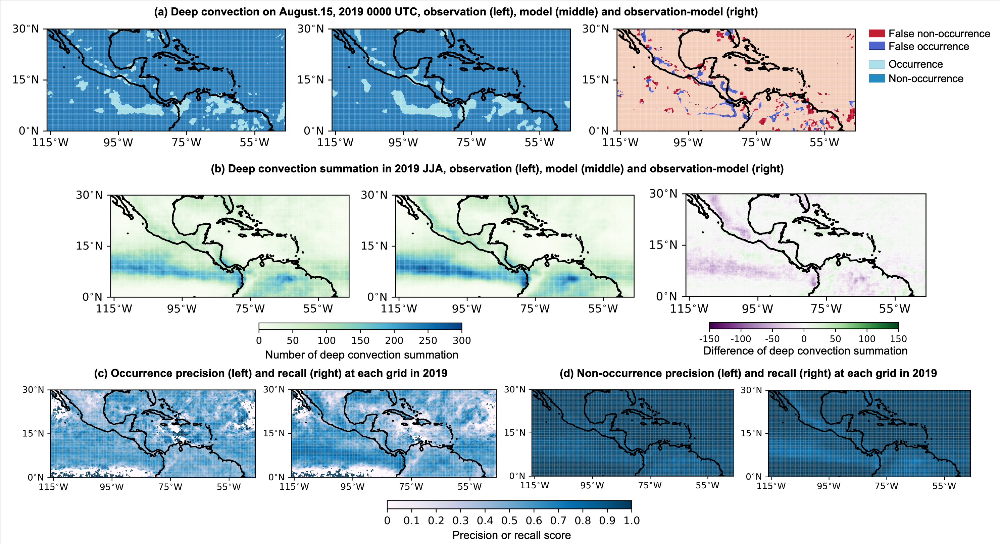








I am an (INTJ) Ph.D candidate at [Department of Earth System Science](https://www.dess.tsinghua.edu.cn), [Tsinghua University](https://www.tsinghua.edu.cn). My major is atmospheric science, and I currently conduct research at the intersection of atmospheric science and artificial intelligence. I started working with Prof. [Haohuan Fu](http://www.thuhpgc.net/mediawiki/index.php/Haohuan_Fu) in Fall 2021, prior to that, I got my Bachelor's degree at [UM-SJTU Joint Institute](https://www.ji.sjtu.edu.cn/cn/), [Shanghai Jiao Tong University](https://www.sjtu.edu.cn), majoring in Mechanical Engineering.

# 📝 Publications 

Geophysical Research Letters

[An Interpretable Weather Forecasting Model With Separately-Learned Dynamics and Physics Neural Networks](https://agupubs.onlinelibrary.wiley.com/doi/full/10.1029/2024GL114310)

**Mengxuan Chen**, Jinxiao Zhang, Runmin Dong, Yidan Xu, Haoyuan Liang, Juepeng Zheng, Lanning Wang, Haohuan Fu\* (2025)

- A lightweight weather forecast model with graph network and multi-layer perceptron is designed to depict dynamics and physics separately. The design of the graph follows the Arakawa C-grid, with the wind speeds embedded as edge features to simulate the large-scale dynamics. Correlations between graph parameters and atmospheric processes highlight model's interpretability, paving way for more reliable predictions.

Journal of Advances in Modeling Earth Systems

[ResU‐Deep: Improving the Trigger Function of Deep Convection in Tropical Regions With Deep Learning](https://agupubs.onlinelibrary.wiley.com/doi/pdf/10.1029/2022MS003521)

**Mengxuan Chen**, Haohuan Fu\*, Tao Zhang, Lanning Wang\* (2023)

- A location-aware and deep-learning-based deep convection trigger function is proposed to improve the diurnal cycle simulation in tropics. Results show that terrain information, temporal dependence of convection, and water vapor content are essential for predicting convection. Also, including information from neighboring atmospheric columns can improve the performance of the deep convection trigger function.

- **Mengxuan Chen**, Ziqi Yuan, Jinxiao Zhang, Runmin Dong, Haohuan Fu\*. Decomposing weather forecasting into advection and convection with neural networks. *arXiv preprint arXiv:2405.06590.* 2024. (This work is a simplied verson of *An Interpretable Weather Forecasting Model With Separately-Learned Dynamics and Physics Neural Networks*)

# 🎖 Honors and Awards
- *2024* Tsinghua comprehensive scholarship
- *2021* Outstanding graduate of Shanghai Jiao Tong University
- *2021* Undergraduate progress scholarship
- *2020* Undergraduate progress scholarship
- *2019* Undergraduate progress scholarship

# 📖 Educations
- *2021.09 - Now* Ph.D Candidate in Department of Earth System Science, Tsinghua University, Beijing, China
- *2017.09 - 2021.08* B. Eng in Shanghai Jiao Tong University, Shanghai, China
- *2019.01 - 2019.02* Winter Exchange Program in Istituto Tecnologico de Buenos Aires, Buenos Aires, Argentina

# 👩🏻‍💻 Experience
- *2024.08 - Now* Research Intern @ National Supercomputing Center (Shenzhen)
  + Weather predictablity and interpretability, flood season predictions
- *2021.03 - 2021.05* Research Intern @ Pilot National Laboratory for Marine Science and Technology
  + Optimization of NEMO ocean model on the Sunway Supercomputer
- *2020.02 - 2021.02* Research Intern @ National Supercomputing Center (Wuxi)
  + Identifying deep convection with machine learning
